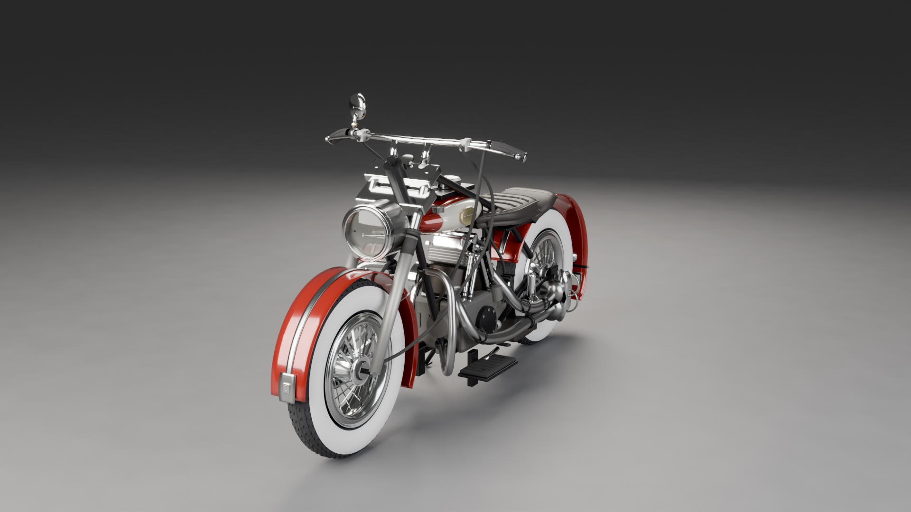
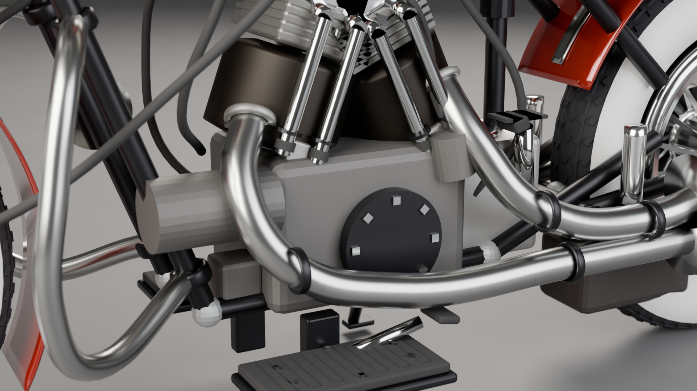

# CAPYBALA BPY SKILL - BLENDER AUTOMATION

<a href="README.md">English</a> | <a href="README.zh-TW.md">繁體中文</a> | <b>简体中文</b>

一份分量扎实、经过实战打磨的 **SKILL.md**，让 AI coding agent 通过无头（headless）Blender 完成建模、材质、灯光、渲染与导出——目标是**第一次交付就达到真正的质量水准**，而不是一份还要来回三轮"再改一下"的粗坯。

🦫 这是 **Capybala**（一款即将推出的 AI agent 桌面应用）的内置能力之一，这里单独拿出来分享。

  
  
  

## 为什么会有这个东西

GPT-6 ASTRA 推出之后，各大时间线上突然到处都是令人惊艳的 3D 生成结果——完整的产品渲染图、整栋建筑、整个场景，看起来几乎是免费生成出来的。很难不去想：一个便宜、快速、完全没受过 3D 专门训练的模型，有没有可能做出接近的东西？

当然不是要跟 GPT-6 那个级别比——那从来都不是目标。真正想知道的是：能不能打败"叫 LLM 随便写几行 `bpy` 代码、赌它会好看"这种常见结果——通常是几何对不齐、材质不管指定什么都像塑料、相机角度全凭猜测。

这份 skill，就是拿 **DeepSeek V4.1 Flash** 这个具体目标去追这个问题之后的产物——一个小、便宜、没有任何特殊之处的模型。放着不管，它产出的正是上面说的那种粗糙结果。通过这份 skill 的 Stage A → B → C 工作流程（动手前先规划组件清单、按照校准过的相机/灯光/材质预设值建模、完工前用实际渲染统计数据自我审查一轮），产出的就是下面这个 gallery。

这是 GPT-6 ASTRA 的水准吗？不是，这里没有任何一句话这样宣称。但对一个完全没有 3D 专长的模型来说，"没有这份 skill"跟"有这份 skill"之间的差距，正是做这个项目的全部意义。

Gallery 里的每一张图，都是 **Capybala 自己的 agent runtime**（尚未公开）驱动 DeepSeek V4.1 Flash、通过这份 skill 生成的。skill 本身不依赖那个 agent——见下方[跟 agent 一起使用](#跟-agent-一起使用)——任何能跑 Python、能读写文件的 coding agent 都能以同样的方式运作。

## 诚实面对的局限（看 gallery 之前请先读这段）

- **下面每一张图都是用 DeepSeek V4.1 Flash 做的**——不是更聪明、更贵的模型。换一个模型套用这份 skill，结果会往任一方向移动：更强的模型可能更懂得照着判断逻辑走、产出更干净的结果；较弱的模型可能需要更多修正轮次，或达不到这里展示的水准。这个 gallery 不是任何模型的保证值。
- **这个 gallery 是精选过的，不是平均水准。** 这些是一堆尝试里挑出来值得展示的成果，很多其他尝试没有做到这个水准——对一个"辅助模型判断、不是取代判断"的工具来说，这是正常现象。
- **有两类主题是目前已知、确实存在的弱项：车辆和人形。** 车身钣件（复合曲面、接缝、可信的比例）跟人体结构，都是这份 skill 技法库还很薄弱、结果不稳定的领域——比起下面展示的产品/建筑/硬表面类主题，车辆和人形更容易做得粗糙、需要更多手动修正，甚至直接失败。下面那辆复古自行车和复古 Harley 风机车是刚好做得不错的个例，不代表车辆类的一般水准——两者都是两轮、以镀铬机械结构为主，刚好吃到这份 skill 硬表面类的强项；汽车车身或人形骑手是完全不同、难度更高、这份 skill 还没验证过的问题。

## Gallery

| | | |
|---|---|---|
|  世界贸易中心双塔 |  机械潜水表 |  双孔意式咖啡机 |
|  复古敞篷自行车 |  货运自行车 |  雷峰塔 |
|  Nova Tower 办公大楼 |  20 层住宅大楼 |  模块化空间站 |
|  发射台上的运载火箭 |  复古镀铬电风扇 |  复古 Harley 风 FLH 机车 |

### 更多角度与细节

  
  
  
  

<em>最后一张是曝光校准过程中的中间渲染，刻意原样保留——这份 skill 在正式出图前会跑一轮自我校正，这是那个过程的真实样貌，不是藏起来的失误。</em>

  
  
  

  

  
  
  

上面每个场景（加上这些额外角度）的完整分辨率 `.blend` 工程文件，都打包成下载文件放在这个 repo 的 [Releases](../../releases) 页面——欢迎自己用 Blender 5.1 打开看看，每个场景实际上是怎么搭出来的。

## 里面到底装了什么

这不是一句简短的 prompt，而是一份完整的操作手册加上一整套代码库：

- **`SKILL.md`**——agent 动手前要读的操作手册：上面提到的 Stage A → B → C 工作流程、经过验证的 Blender 5.1 API 差异对照表、按真实渲染输出校准过的相机/灯光/曝光预设值，还有一长串"这样做会出问题，这是解法"的规则，涵盖最容易被忽略的视觉失误（穿模、悬空、材质呆板没有生气、相机构图错误等等）。
- **`assets/*.py`**——一套纯 `bpy` Python 代码库（材质、参数化造型、建筑、道路、自然地形、细节加工、从参考图重建三视图、几何测量工具），让 agent 直接调用，不用每次都手刻基础形状。不依赖任何 app——就是普通的 Blender Python，装了 Blender 的人都能直接跑。
- **`assets/anatomy/`**——按产品/建筑/容器类别整理的组件清单（例如"机械表该有哪些零件，不要做成一个空壳"），确保明显的东西不会被漏掉。
- **`assets/styles/`**——具名的设计风格参考卡（建筑师、工业设计流派、类型风格），附带具体的比例/材质/色卡数值，而不是模糊的氛围形容词。
- **`assets/examples/`**——按主题类型整理的完整端到端示例。
- **`assets/scene_pkg/`**——结构化的场景包格式（config/layout/geometry/materials/assertions），给规模超出单一脚本的场景用。

## 环境要求

- Blender 5.1.x（针对 5.1.2 验证过；其他 5.1.x 版本应该很接近，见 `SKILL.md` 开头的版本漂移警告）
- Python 3（`assets/*.py` 代码库用 Blender 内置的解释器就够；`assets/component_measure.py` 这类独立脚本通过 `blender --background --python ...` 执行）
- 可选：[ahujasid/blender-mcp](https://github.com/ahujasid/blender-mcp)（MIT）——如果你想从支持 MCP 的客户端交互控制，而不是纯无头脚本——`SKILL.md` §0–§1 两条路径都有覆盖，包含一支六级 `blender.exe` 路径解析器（`assets/find_blender.ps1`，Windows），避免写死安装路径。

## 跟 agent 一起使用

`SKILL.md` 原本是为了在 Capybala 自己的工具组里运行的 agent 而写的，所以有一部分指令会调用特定的原生工具名称（`read_image_native`、`run_python_native`、`read_file_native`、`write_file_native`）——每一处出现这些名称的地方，都在原地注明了其他平台的等价操作。如果你是人类直接照着手册操作，或是要接到别的 agent 框架上，这些指令对应的都是最普通的动作："看一下这张图""跑这段 Python""读/写这个文件"。真正的 Blender/bpy 技法内容——`assets/` 目录下的所有东西——完全没有这种依赖，可以独立使用。

这份文档也遵循 **Claude Code** 与其他支持可加载 skill 的 agent 平台通用的 skill 文件约定——只要在 `SKILL.md` 最上面加上标准的 YAML frontmatter（`name`/`description`），把整个文件夹放进 `.claude/skills/`（或你平台的对应位置），就能直接在那边使用。

### 关于语言的说明

`SKILL.md` 原文是用**繁体中文**撰写的（代码、函数名、API 引用按 Python/Blender 的规矩保持英文，只有说明文字是中文）。繁体中文和简体中文在技术文档这种场合差异很小，直接读通常完全没问题；如果你想要一份简体版本方便阅读，也可以直接请你的 AI 帮忙转换，内容不会有损失。

## 技术亮点

几个真正有工程深度、不只是"叫模型小心一点"这种空话的地方：

**几何质量是测出来的，不是叫模型自己看着办。** `build_template.py` 内置一套建完就自动运行的审核：`audit_interpenetration()` 两两扫描物体找真正的重叠（先用包围盒快筛，紧密贴合的机构件——卡钳贴刹车盘、轮圈套轮胎——可选用 BVH 网格级相交判定，这种情况下包围盒重叠本身没有意义）；`audit_floating()` 对每个物体的底面做 raycast 寻找支撑面，但分得清"放在什么上面"跟"侧向锁固/螺栓固定在什么侧面"是两回事（`mark_side_attached()`/`mark_joint_attached()` 会把悬臂或锁固的零件改走表面间距检查，而不是重力式支撑检查，墙上的标牌不会被误判成悬空）；`audit_spacing()` 抓阵列里坐标悄悄跑偏的那一件。这些不是可选建议——结果会写进 Stage C 强制要查的场景状态字段，而且容差会按主体实际尺度自动调整（一台 138mm 的相机和一栋 40 层大楼，容差不会用同一套毫米级标准）。

**用"制造业"的思维取代"堆方块"。** 这份 skill 把几何当成真实物体实际被制造出来的样子在处理：开口用布尔差集挖出来、有真实的壁厚（不是"那里就不建墙"这种假开口）；边缘的倒角/圆角半径是按物体尺度主动决定的值（不是 Blender 默认的零倒角）；任何现实中会用车床车出来的零件——表冠、旋钮、相机镜筒、瓶盖——一律用旋转剖面函数建出来，而不是圆柱体加倒角修改器，因为真实车制件的半径是沿轴向连续变化的，这是"拉伸再倒角"这个组合在结构上做不到的事。

**曝光是通过/不通过的硬性关卡，不是凭感觉看看。** 每一种场景类型（棚拍、户外黄金时刻、夜景）都有数字化的亮度目标区间，渲染结果超出范围会在送到人眼前就自动判定失败。灯光能量来自按真实渲染输出校准过、并按主体包围盒缩放的预设值，而不是照抄绝对数字；另外还有一个 mean/median 差值检查，专门抓"一个亮点（一扇亮着的窗、一块招牌）把平均值撑进合格范围，但画面其余大部分接近全黑"这种假通过。

**复刻真实物体被当成测量问题处理，不是凭感觉画。** 当有真实世界的对应物体时，参考资料会被分成四个证据等级——从官方正交工程图到只有规格数字——每一级明确规定它能证明到什么程度，让一张普通照片可以用来推估比例，但永远不会被拿来跟标注尺寸的工程图同等级引用。整套比对流程（校准 → 提取轮廓 → 放样 → 闭环验证）会把规划阶段的组件清单跟实际测量到的几何互相比对两次——动工前一次、完工后一次；还有一个标注图生成器，会把测量到的轮廓画回原始参考照片上并标上编号，让后续的修改意见可以直接说"A-3 位置不对"，不需要用一整段文字描述坐标。

## 许可证

MIT——见 [LICENSE](../LICENSE)。
